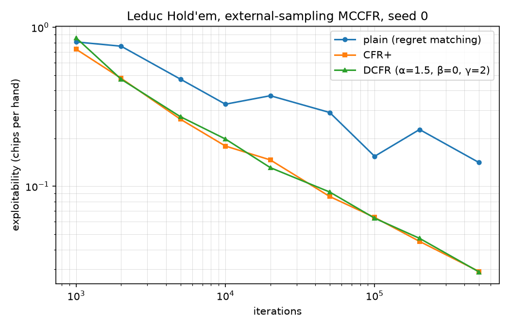

# mccfr-poker

External-sampling Monte Carlo Counterfactual Regret Minimization for computing game-theory-optimal (Nash equilibrium) strategies in poker. Verified on Kuhn and Leduc Hold'em with an exact exploitability oracle.

See [EXPLANATION.md](EXPLANATION.md) for how and why it works.

## Quick start

```bash
pip install -r requirements.txt
python3 train.py kuhn  --iterations 300000
python3 train.py leduc --iterations 300000
python3 train.py leduc --iterations 300000 --plus   # CFR+ (Tammelin 2014)
python3 train.py leduc --iterations 300000 --variant dcfr  # Discounted CFR
python3 train.py kuhn  --sampler outcome            # outcome-sampling MCCFR
python3 train.py leduc --iterations 500000 --plus --save leduc.json
python3 strategy.py leduc.json                      # readable poker chart
python3 play.py --strategy leduc.json               # play heads-up against it
python3 -m pytest test_solver.py -v

./build_rust.sh                                     # optional: ~120x faster Leduc
python3 bench.py                                    # before/after numbers
```

Kuhn converges to the known Nash value of -1/18 for player 0 in a few seconds.

## Convergence

Three update rules are available on both samplers via `--variant`:

| variant | what it does |
|---|---|
| `plain` | regret matching, uniform average (Zinkevich et al. 2007) |
| `plus` | CFR+ (Tammelin 2014): clip cumulative regret at zero, weight the average linearly by iteration |
| `dcfr` | Discounted CFR (Brown & Sandholm 2019): discount positive regret by t^α/(t^α+1), negative by t^β/(t^β+1), and the average by (t/(t+1))^γ, with α=1.5, β=0, γ=2 |

Leduc Hold'em exploitability, external sampling, seed 0:

| iterations | plain | CFR+ | DCFR |
|---|---|---|---|
| 50,000 | 0.29117 | 0.08625 | 0.09204 |
| 100,000 | 0.15437 | 0.06370 | 0.06303 |
| 200,000 | 0.22763 | 0.04503 | 0.04706 |
| 500,000 | 0.14114 | 0.02914 | 0.02896 |



CFR+ and DCFR are close to each other and roughly 5x better than plain regret matching at 500k iterations. Plain is also visibly non-monotone: with uniform averaging the sampling noise of external sampling is not damped, so more iterations can temporarily make the average strategy worse. Regenerate the plot with `python3 plots/convergence.py` (add `--replot` to redraw from the saved JSON without retraining).

## Native acceleration

The Leduc training loop is also implemented in Rust (`rust/src/lib.rs`, exposed through PyO3). It is **optional**: without it everything runs in pure Python, and with it `MCCFRTrainer` picks it up automatically for standard Leduc. The public interface does not change.

```bash
./build_rust.sh          # needs a Rust toolchain; drops mccfr_rs.so next to mccfr.py
python3 bench.py         # 1M iterations on both backends
```

1,000,000 Leduc iterations, external sampling, seed 0, one core of a Xeon @ 2.10GHz:

| variant | pure Python | Rust | speedup |
|---|---|---|---|
| `plain` | 75.43 s | 0.68 s | **111x** |
| `plus` | 74.66 s | 0.64 s | **117x** |
| `dcfr` | 89.30 s | 0.92 s | **97x** |

That is 13k iterations/second in Python against 1.5M/second in Rust. The test suite drops from 60 s to 28 s as a side effect.

**The results are bit-identical, not merely close.** Same seed in, same floats out, verified field by field across all three variants and across split `train()` calls. Three things are needed for that, and each is done deliberately:

- **The RNG stream is shared, not re-seeded.** Python hands `rng.getstate()` to Rust and takes the state back afterwards, so `self.rng` stays continuous for callers. Rust reimplements CPython's Mersenne Twister draws (`random()`, `getrandbits`, `_randbelow`, `shuffle`, `choice`) bit for bit.
- **Only exactly-specified float operations are used.** The node utility is a plain sequential sum of products, never a fused multiply-add and never `np.dot`. See the note below on why.
- **Accumulation order is preserved** in regret matching, the opponent-sampling cumulative sums, and the regret and strategy updates, since float addition is not associative.

### Why the hot loop avoids `np.dot`

The node utility used to be computed with `np.dot`. That turns out to make training results **depend on the machine**: numpy dispatches the dot product to an OpenBLAS kernel chosen from the CPU's features at runtime, and that kernel contracts the multiply and add into a fused multiply-add on some hosts but not others. FMA rounds once where separate operations round twice, so the two disagree in the last bit, and in a solver whose next sampled action depends on those bits the trajectories then diverge completely.

This was not theoretical. Two CI runners on the same commit disagreed about the same seed, one passing and one failing the Python-versus-Rust comparison. The fix was to drop `np.dot` in favour of a sequential sum, which uses only IEEE-754 multiply and add, both exactly specified, and so gives identical bits on every conforming machine and in either language. It is also about 10% faster at this size, since a numpy call on a 2-3 element array is mostly call overhead. `test_training_is_reproducible_across_machines` pins a fixed seed to literal expected floats so that any reintroduction of a contracted or hardware-dispatched float operation fails loudly.

The native loop is used only when it is a faithful substitute: `sample_root` must be Leduc's, the chance hook is *behaviourally probed* against `deal_public_sample` (same card dealt, same RNG draws consumed), and subclasses such as `OutcomeSamplingTrainer` are excluded because they traverse differently. Anything else silently falls back. Pass `backend="python"` to force the fallback or `backend="rust"` to require the native path.

## Subgame re-solving

`resolve.py` keeps the blueprint for the preflop and re-solves each flop subgame on arrival, using the blueprint's reach probabilities as the subgame's root distribution and vanilla CFR+ as the solver. A subgame is one (preflop line, public card) pair, 15 in all; together they own 270 of Leduc's 288 information sets.

This is **unsafe** re-solving, and the numbers show exactly why that word is there:

| blueprint iterations | blueprint | re-solved | change |
|---|---|---|---|
| 5,000 | 0.26406 | 0.12083 | −54.2% |
| 20,000 | 0.14650 | 0.10040 | −31.5% |
| 100,000 | 0.06370 | 0.13925 | +118.6% |
| 500,000 | 0.02914 | 0.13051 | +347.8% |

Re-solving rescues a weak blueprint and wrecks a strong one. Notice that the re-solved column barely moves (0.10 to 0.14) while the blueprint column improves by a factor of nine: the re-solve is a best response to a *frozen* opponent range, so its quality is capped by how much the opponent gains by deviating preflop to reach the subgame with a different mix of hands, no matter how good the blueprint was. Safe re-solving (Burch, Johanson & Bowling 2014) removes that cap by constraining the re-solve to concede no more than the blueprint already did; it is not implemented here. See the module docstring in `resolve.py` for the full argument.

```bash
python3 resolve.py --blueprint-iterations 20000   # one comparison
python3 resolve.py --sweep                        # the table above
```

## Layout

| File | What it is |
|---|---|
| `mccfr.py` | Game-agnostic MCCFR trainers (external sampling, outcome sampling) and regret-matching info-set nodes |
| `kuhn.py` | Kuhn poker game tree (3 cards, one betting round) |
| `leduc.py` | Leduc Hold'em game tree (6 cards, two rounds, public card, raise cap) |
| `exploitability.py` | Exact best-response computation; the convergence metric |
| `train.py` | CLI: train, report exploitability over time, print the average strategy, `--save` it as JSON |
| `strategy.py` | Save/load strategy tables as JSON; print a Leduc strategy as a readable poker chart |
| `play.py` | Interactive CLI: play heads-up Leduc against a saved strategy, seats alternate, chips tracked |
| `resolve.py` | Unsafe subgame re-solving of Leduc's flop against the blueprint's range, with a measurement CLI |
| `rust/` | Optional PyO3 extension: the Leduc loop in Rust, bit-identical and ~120x faster (`./build_rust.sh`) |
| `bench.py` | Times both backends on the same workload and checks they agree exactly |
| `plots/convergence.py` | Measures and plots exploitability vs iterations for all three variants |
| `test_solver.py` | Game-logic and convergence tests against theory |

## Adding a game

Implement a state class with `is_terminal()`, `current_player()` (returns `0`, `1`, or `"CHANCE"`), `legal_actions()`, `next_state(a)`, `info_set_key()`, `utility(player)`, plus `sample_root(rng)` and `enumerate_deals()`. If the game has mid-hand chance nodes, also provide a sampler and pass it as `sample_chance` to `MCCFRTrainer`. `mccfr.py` and `exploitability.py` need no changes.
